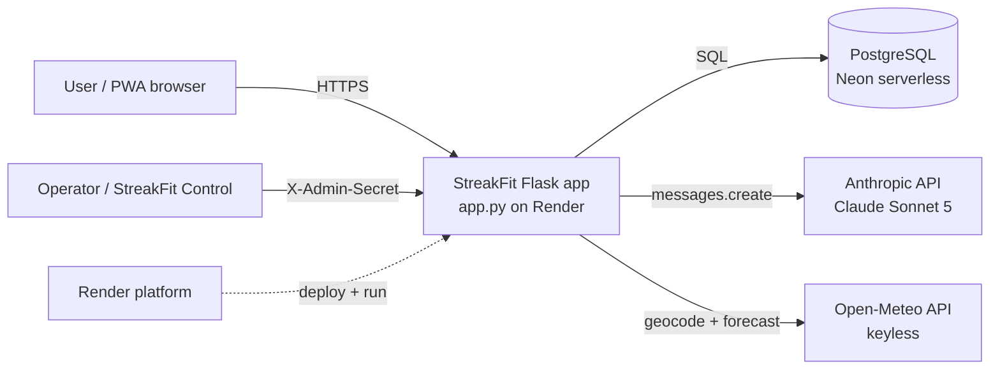
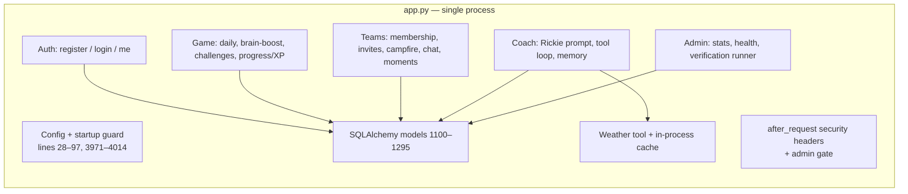

# StreakFit Backend — Architecture Overview

> Audience: a senior engineer who will own this service. This document explains **what the system is, how it is shaped, and why** — so you can make changes safely without re-deriving the design.

## What StreakFit is

A fitness-streak PWA. Users complete a small "Daily Mission" of exercises, answer a "Brain Boost" question, build streaks, earn XP/acorns, join small teams with a shared "campfire" progress meter, and chat with **Rickie**, an AI coach (Anthropic Claude) with a deliberate character and small cross-session memory.

- **Frontend:** a vanilla-JS PWA served as static files (`static/app.js` ~204 KB single file, `style.css`, `sw.js`). No build step.
- **Backend:** a single Flask module, `app.py` (~4,000 lines). This is the entire server.
- **Data:** PostgreSQL in production (Neon serverless), SQLite for tests/local.
- **AI:** Anthropic Claude Sonnet 5 for the coach, Open-Meteo (keyless) for weather.
- **Hosting:** Render, git-linked (`git push origin main` auto-deploys), single gunicorn worker.

## System context

**Trust boundaries.** The browser is untrusted — all state that matters (stats, streaks, coach history) is server-owned and re-derived from the DB, never taken from the client. The admin surface is gated by a shared secret compared in constant time. The two outbound integrations (Anthropic, Open-Meteo) fail *closed and quiet*: an outage degrades one feature and never fabricates data.

## Container / module view

Everything below lives inside the one `app.py` process. The "modules" are logical groupings, not separate files.

## Why it is shaped this way

- **Single-file monolith** — one solo maintainer, a small surface, and a deploy model where "the app" is literally `app:app`. The cost is navigability and merge friction; see [ADR-0001](../adrs/0001-single-file-flask-monolith.md). When a second engineer joins for real, the first refactor is extracting blueprints — but not before (premature module boundaries would be guessed, not learned).
- **Server owns all truth** — the PWA is a rendering layer. The coach ignores client-sent history ([ADR-0002](../adrs/0002-server-owned-conversation-history.md)); stats are recomputed; the client can't grant itself XP.
- **Fail-closed integrations** — missing `ANTHROPIC_API_KEY` → coach returns `503`, rest of app unaffected; Open-Meteo 429 → Rickie says he couldn't reach the weather, never invents a forecast.
- **Migrations are the source of truth** — the schema is built only by the Alembic chain, and the process refuses to boot on a mismatched schema ([ADR-0010](../adrs/0010-migrations-single-source-of-truth.md)).

## Where to read next

| You want to understand… | Read |
|---|---|
| How a request flows end-to-end | [request-flows.md](request-flows.md) |
| Login, JWT, password handling | [authentication.md](authentication.md) |
| Rickie, memory, Coach Notes, weather, cache | [coach-subsystem.md](coach-subsystem.md) |
| Tables, FKs, deletion policy | [data-model.md](data-model.md) |
| Teams, invites, campfire, chat, moments | [teams.md](teams.md) |
| Deploy, Render, startup guard | [deployment.md](deployment.md) |
| The end-to-end verification suite + pytest | [verification-suite.md](verification-suite.md) |
| Why each big decision was made | [../adrs/](../adrs/) |
| Every endpoint | [../api/openapi.yaml](../api/openapi.yaml) |
| What to fix, and when | [../engineering-roadmap.md](../engineering-roadmap.md) |
| What breaks at 100k users | [../operations/production-readiness.md](../operations/production-readiness.md) |

## Ground-truth reference points (verify before trusting docs)

Code moves; these anchors were accurate as of commit `56444f9` (2026-07-25):

- Models: `app.py` ~1100–1295. Routes: search `@app.route`. Config/startup: 28–97 and 3971–4014.
- Coach: `coach()` at ~3809; memory helpers ~3450–3525; weather/cache ~3620–3765.
- Constants worth knowing: coach model `claude-sonnet-5`, `max_tokens=768`, memory window 10 turns, geocode TTL 30d, forecast TTL 10m, cache cap 512, body limit 256 KB, JWT expiry 1h.
