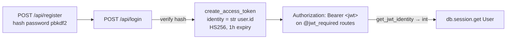

# Authentication & Authorization

Two independent auth schemes: **JWT bearer tokens** for users, and a **shared admin secret** for operator routes. There is no session/cookie auth, no refresh token, and no role system beyond "user vs admin-secret-holder."

## User authentication (JWT)



### Registration (`register()` ~1862)
- Validates: username 2–80 chars, password 8–128 chars.
- Hashes with Werkzeug `generate_password_hash(..., method='pbkdf2:sha256')`.
- Duplicate username caught two ways: a pre-check **and** an `IntegrityError` handler on commit (race-safe) — both return a clean `400`, never a `500`. See `tests/test_auth.py`.
- Best-effort `AnalyticsEvent('account_created')`; its failure is swallowed.

### Login (`login()` ~1912)
- **Timing-equalized:** `check_password_hash` always runs — against the real hash if the user exists, else against a module-level `_DUMMY_PW_HASH` computed once at import. An attacker can't distinguish "no such user" from "wrong password" by response time. ([ADR-0008](../adrs/0008-security-headers-and-login-timing.md))
- Success → `{access_token}`. Failure → uniform `401`.
- **Cost floor ≈ 81 ms** (pbkdf2). This is the dominant latency of login and is deliberate — do not "optimize" it away.
- Rate limit: **10/min per IP** — genuinely per client since `ProxyFix(x_for=2)` (see [deployment.md](deployment.md#proxy-chain-and-the-real-client-ip)). Before that fix the key was a Render-internal address, so the effective ceiling was ~6-7× higher. Login/register stay **per IP** deliberately: there is no identity to key on before authentication. Authenticated routes are keyed per user instead — see [Which limits are keyed on what](deployment.md#which-limits-are-keyed-on-what).

### Token properties
| Property | Value | Source |
|---|---|---|
| Algorithm | HS256 | `JWT_SECRET_KEY` (env, required at import) |
| Identity | `str(user.id)` | `create_access_token` |
| Expiry | 1 hour | `JWT_ACCESS_TOKEN_EXPIRES` |
| Location | Authorization Bearer header | flask-jwt-extended default (not explicitly configured) |
| Refresh | **none** | — |

### JWT error responses (`jwt` callbacks ~3938)
| Situation | Status | Body |
|---|---|---|
| Missing / unauthorized | 401 | `{"error":"Missing or invalid token"}` |
| Invalid token | 422 | `{"error":"Invalid token"}` |
| Expired token | 401 | `{"error":"Token has expired"}` |

> **Consequence to know:** with a 1-hour expiry and no refresh token, the PWA must handle a mid-session `401` by re-logging-in. There is no silent renewal. This is fine today; if session length becomes a UX complaint, adding a refresh token is the change — see the roadmap.

### Per-user authorization
There are no roles. Authorization is **ownership checks inside handlers**: a resource is readable/writable only if it belongs to `get_jwt_identity()`. Examples: challenges filter on `user_id`; team reads require an active `TeamMembership`; `DELETE /api/coach/memory` and account deletion operate strictly on the token's own user. This is simple and correct but **repeated by hand** in every handler — a future extraction candidate (a `@team_member_required` decorator), noted in the roadmap.

## Admin authentication (shared secret)

All `/api/admin/*` routes call `_require_admin_secret()` (~1418):

```python
secret = request.headers.get('X-Admin-Secret', '')
env_secret = os.environ.get('ADMIN_SECRET', '')
if not env_secret or not hmac.compare_digest(secret.encode('utf-8'), env_secret.encode('utf-8')):
    abort(403)
```

- **Constant-time** compare (`hmac.compare_digest`) prevents a byte-by-byte timing oracle.
- **Fails closed:** if `ADMIN_SECRET` is unset/empty, every admin route is `403` — the admin surface can't accidentally open.
- Operands are `.encode()`-ed so a non-ASCII header returns `403`, not a `500` (this was the WS10 post-review fix, `113c9e1`).
- The `403` here is Flask's default (non-JSON) body — a known, documented inconsistency with the rest of the API.

> **Consequence to know:** the admin scheme is a single shared secret with no rotation, no audit log, and no per-operator identity. Adequate for one operator; the roadmap flags real admin auth as a medium-term item if the operator set grows.

## Threat notes (see also `docs/security_review.md`)
- Password hashing: pbkdf2:sha256 (Werkzeug default). Adequate; argon2 is a possible future upgrade.
- No account lockout / brute-force throttle beyond the 10/min IP limit. That limit is now correctly keyed per client (`ProxyFix(x_for=2)`), but its storage is still `memory://` — process-local and reset on every deploy — so a determined attacker can retry across deploys, and it will partition if a second worker is ever added. Shared storage (roadmap **M1**) remains the next step. Note NAT/office/carrier clients share a bucket by nature; that is inherent to per-IP limiting, not a defect.
- No email/recovery flow exists — there is no password reset. Username + password is the whole identity model.
