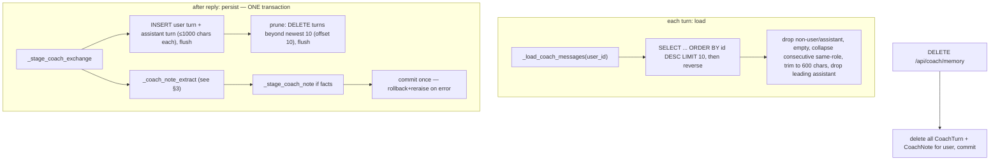
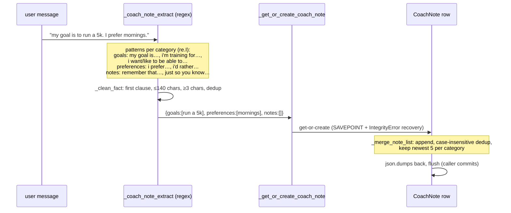
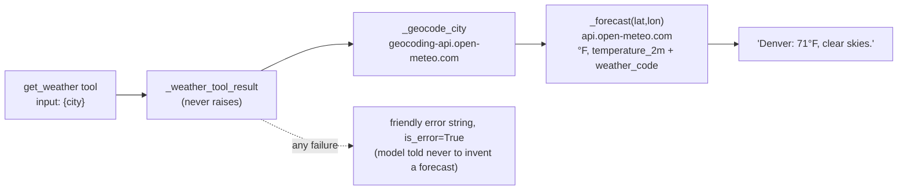

# Coach Subsystem ("Rickie")

Rickie is an Anthropic Claude coach with a fixed character, one tool (weather), and a small, deterministic, server-owned memory. This is the most subtle part of the backend. The design goal (from the product) is **"someone users enjoy talking to, not a Q&A bot"** — every technical choice below serves that, and several are load-bearing for user trust.

Source: `coach()` ~3809; memory ~3450–3525; notes ~3354–3450; weather/cache ~3620–3765. Constants table at the end. Related: [../adrs/0002](../adrs/0002-server-owned-conversation-history.md)–[0005](../adrs/0005-in-process-weather-cache.md), `docs/rickie_character_bible.md` (character source of truth), `docs/memory_pipeline.md`.

## 1. Request flow & prompt assembly

`POST /api/coach` (JWT; rate-limited **10/day + 3/min**). Validation: `message` required, ≤500 chars; `context.type ∈ {general, insight}`. No `ANTHROPIC_API_KEY` → `503 coach_unavailable`.

The **system prompt** is assembled fresh each turn, in this order:
1. `_COACH_SYSTEM_PROMPT` — the frozen character prompt (derived from the Character Bible; do not tune without a new failure category, per project rule).
2. `_build_rickie_context(user)` — a server-derived stats snapshot (name, current/best streak, total missions, level, **pre-computed** milestone math). Wrapped in try/except: a stats failure can't break the coach.
3. `_load_coach_note_block(user.id)` — the Coach Notes background block (only if non-empty). Logs `event=coach_memory_inject`.
4. If `context.type == 'insight'` and an `insight_text` is supplied: today's insight, with an "add depth without restating" instruction.
5. If the message contains a joke-trigger word (`joke/funny/silly/laugh/pun/hilarious`): up to 5 sampled jokes.

The **message list** is `_load_coach_messages(user.id)` (server's own last-10 window) + the new user message. **Client-sent history is ignored** ([ADR-0002](../adrs/0002-server-owned-conversation-history.md)).

### The tool-use loop
```python
for _ in range(3):                       # initial call + up to 2 tool rounds
    response = client.messages.create(model='claude-sonnet-5', max_tokens=768,
                                       thinking={"type":"disabled"},
                                       system=system, messages=messages, tools=[_WEATHER_TOOL])
    if response.stop_reason != 'tool_use': break
    # append assistant turn, run get_weather for each tool_use block,
    # append tool_result blocks (is_error on failure), loop
```
Reply = first `text` block. On success, `_persist_coach_interaction(user.id, message, reply)` runs (failure logged, reply still returned). Any exception in the whole block → `503`.

> **Model/params are inline literals** (`'claude-sonnet-5'`, `max_tokens=768`, `thinking` disabled) at ~3880–3887 — a model bump is an edit there, not a config change. Flagged in the roadmap as a small config-extraction candidate.

## 2. Cross-session memory lifecycle (`CoachTurn`)

One row per message; a rolling window of the **last 10 turns** is the entire long conversational memory. Server-owned end to end.



- **Load** returns an alternation-safe, trimmed history (600-char prompt slice). Consecutive same-role turns are collapsed and leading assistant turns dropped so the list is always `user, assistant, user, …`.
- **Persist** is atomic ([ADR-0004](../adrs/0004-atomic-coach-persistence.md)): both turns + prune + any extracted note commit together or not at all. Measured cost ≈ **9 SQL statements per coach message** (2 inserts, prune select + deletes, note get/create + merge, commit) — fine at current scale, noted in the roadmap as the heaviest per-turn write path.
- **Pruning** keeps storage bounded to ~10 turns/user; there is no separate cron.
- **Forget** (`_forget_coach_memory`) deletes both tables for the caller, idempotently — the user-facing "Forget our conversations" control.

Why a small window and not full history: cost, latency, and the product decision to keep memory "a coach who remembers the gist," not a transcript. It also fixed a real cross-turn repetition bug (the model was echoing client-sent history).

## 3. CoachNote lifecycle (deterministic, never model-written)

A single `CoachNote` row per user holds three JSON lists — `goals`, `preferences`, `notes` — populated **only** by a deterministic regex over the *user's own words*. The model has no memory-write tool and never edits notes. This is a trust guarantee: Rickie can never "remember" something you didn't say. ([ADR-0003](../adrs/0003-coach-notes-deterministic-extraction.md))



- **Extraction** runs on the user message only, never on Rickie's output.
- **Get-or-create race safety:** `_get_or_create_coach_note` inserts inside a `begin_nested()` SAVEPOINT; a concurrent creator that wins the `unique(user_id)` constraint raises `IntegrityError`, which is caught and the existing row re-fetched — without poisoning the outer transaction. ([ADR-0009](../adrs/0009-transaction-boundaries.md))
- **Injection** (`_load_coach_note_block`): notes are rendered as *background context Rickie must not recite* ("never say 'I remember,' never list these back"). The non-recitation instruction lives in the injection block, not the frozen prompt — so it travels with the data.
- **Caps:** 5 items/category, 140 chars/item — bounded storage and prompt size.

## 4. Weather subsystem

The coach's only tool. Provider: **Open-Meteo, keyless**. A lookup is two stdlib-`urllib` GETs: geocode (city → lat/lon) then forecast.



- **Contract:** `_weather_tool_result` returns `(text, is_error)` and **never raises** — empty city, not-found, no-data, and network failure all return a friendly `is_error=True` string. The tool schema instructs the model to ask for a city if none is given and never fabricate on error.
- **Outbound calls per lookup:** 2 uncached, 1 if geocode cached, **0 if both cached**.
- **User-Agent** `StreakFit-Rickie/1.0`, 6-second timeout.
- **Why it exists / why one tool:** weather is the single, safe, genuinely-useful thing that makes Rickie feel present ("good day for a walk"). It has no side effects and no stored location. More tools = more surface and more ways to break character; the bar for a second tool is high.

## 5. Cache lifecycle

Two in-process dicts cut StreakFit's own outbound calls — the fix for intermittent **429s on Render's shared egress IP** (other tenants share the IP; our repeated lookups were the part we could control). [ADR-0005](../adrs/0005-in-process-weather-cache.md)

| Cache | Key | TTL | Notes |
|---|---|---|---|
| `_GEOCODE_CACHE` | city, lowercased + whitespace-collapsed | 30 days | city→coords is ~static |
| `_FORECAST_CACHE` | `(round(lat,4), round(lon,4))` | 10 min | weather changes slowly enough |

- **Thread-safe:** all reads/writes hold `_CACHE_LOCK` (a `threading.Lock`), so eviction can't race with a put under gunicorn's threads. Provider HTTP happens *outside* the lock (no long holds).
- **Bounded:** `_CACHE_MAX_ENTRIES = 512` per cache. Eviction (`_cache_evict_one`, caller holds the lock): remove the oldest **expired** entry, else the oldest **inserted** (FIFO) — not true LRU, deliberately simple.
- **Best-effort:** per-worker, in-memory, lost on restart. With a single gunicorn worker today the cache is effectively shared. If we scale to multiple workers, each has its own cache (Nx the provider calls) — the documented escalation is a **keyed Open-Meteo provider** or shared cache, not more in-process cleverness.
- **Misses are not cached:** a geocode with no results or a forecast with null temp returns `None` and is not stored (so a transient bad response doesn't stick).

## Constants (verify at these lines before trusting)
| Constant | Value | ~line |
|---|---|---|
| model | `claude-sonnet-5` | 3880 |
| `max_tokens` | 768 | 3881 |
| `thinking` | disabled | 3887 |
| tool loop bound | 3 (initial + 2) | 3878 |
| `_COACH_MEMORY_WINDOW` | 10 | 3308 |
| `_COACH_TURN_MAX_LEN` / `_COACH_TURN_PROMPT_LEN` | 1000 / 600 | 3309/3310 |
| `_COACH_NOTE_MAX_ITEMS` / `_MAX_LEN` / `_MIN_LEN` | 5 / 140 / 3 | 3311–3313 |
| `_GEOCODE_TTL` / `_FORECAST_TTL` | 30 d / 10 min | 3667/3668 |
| `_CACHE_MAX_ENTRIES` | 512 | 3669 |
| message cap | 500 chars | 3814 |

> **Doc drift to fix:** `docs/memory_pipeline.md` still describes the pre-atomic persist path (`_record_coach_exchange` + `_update_coach_note` as the request path). The request path is now `_persist_coach_interaction`; the older helpers are CLI/test-only. Update that doc when you touch this area. (Logged in the roadmap.)
