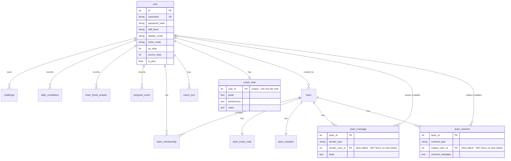
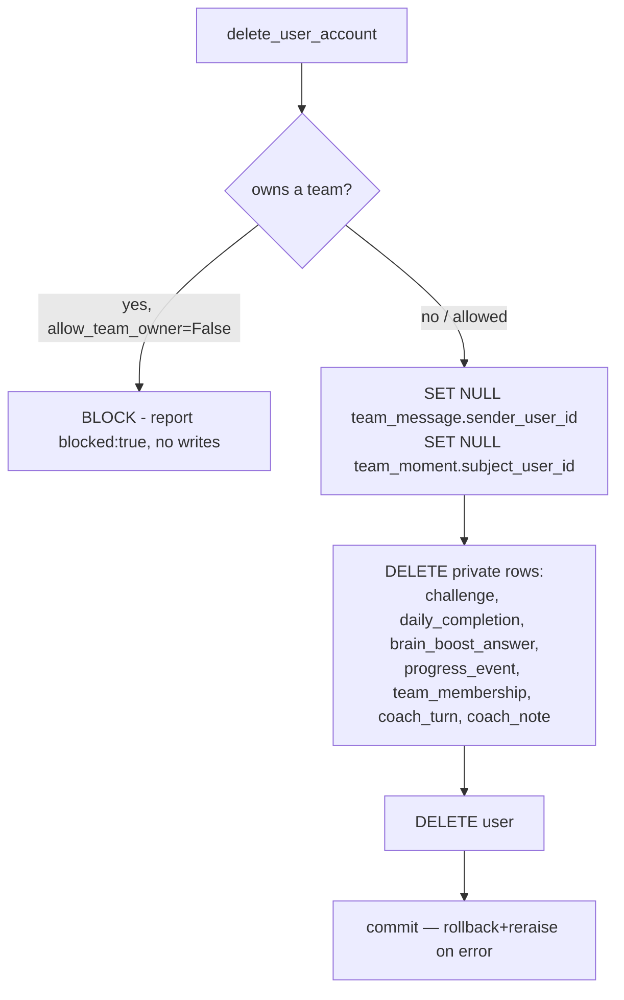

# Data Model

15 tables, one Postgres database. **Almost no ORM relationships** — associations are foreign-key columns joined explicitly in handlers (there is exactly one `relationship()`: `User.challenges`). This is a deliberate simplicity choice with real consequences for how you query (you write the joins) and how you delete (the app enforces integrity, not the DB). Models: `app.py` ~1100–1295. Deletion policy: [`../db_integrity_matrix.md`](../db_integrity_matrix.md) and [ADR-0006](../adrs/0006-application-level-account-deletion.md).

## Entity-relationship diagram

## Tables at a glance

| Table | Purpose | Key columns / constraints |
|---|---|---|
| `user` | account + game stats | `username` unique; stats denormalized on the row (xp/acorns) |
| `challenge` | user-defined streak challenges | FK `user_id`; the ONLY table with an ORM `relationship` (`User.challenges`, backref `owner`) |
| `daily_completion` | one row per exercise done | `uq_daily_completion(user_id,date,exercise_key)` → idempotency; idx `(user_id,date)` |
| `brain_boost_answer` | daily quiz answer | `uq_brain_boost_answer(user_id,date)` → one/day |
| `progress_event` | XP/acorn audit log | FK `user_id`; **`team_id` is a bare Integer, not a FK** (integrity gap) |
| `analytics_event` | funnel events | idx `(event_name, created_at)` |
| `team` | a team | FK `created_by_user_id` (NOT NULL) |
| `team_membership` | user↔team join | `uq_team_membership(team_id,user_id)`; idx `user_id` |
| `team_invite_code` | current invite code | `unique(team_id)`, `unique(code)` |
| `team_message` | team chat + Rickie posts | idx `team_id`; `sender_user_id` **nullable** |
| `team_moment` | team timeline | idx `team_id`; `subject_user_id` **nullable**; `moment_metadata` renamed to dodge SQLAlchemy's `metadata` |
| `team_campfire` | cumulative team missions | `unique(team_id)` |
| `coach_turn` | rolling conversation memory | idx `user_id`; pruned to last 10/user |
| `coach_note` | extracted facts | `unique(user_id)` → one row/user |
| `verification_run` | end-to-end suite run records | no FKs |

Full column-level detail (types, nullability, defaults) lives in the migration chain and the model classes; regenerate from `app.py` if you need the exact list.

## Two integrity notes worth internalizing

1. **`progress_event.team_id` is not a foreign key** — it's a plain nullable Integer that semantically references a team. Deleting a team leaves those values dangling. Low-impact (it's an audit log, read defensively), but it's a real referential gap. Do not assume a join to `team` is safe there.
2. **No `ON DELETE` behavior exists in the DB.** Every FK is "no action." A raw `DELETE FROM user` would FK-error (Postgres) or orphan rows (SQLite). The app never does raw deletes — see below.

## Deletion policy (enforced in the application layer)

`delete_user_account(user_id, allow_team_owner=False, dry_run=True)` is the only sanctioned way to delete a user. It runs as **one transaction** and encodes the policy the DB doesn't: ([ADR-0006](../adrs/0006-application-level-account-deletion.md))

- **Private data** (progress, coach memory, memberships) is deleted.
- **Shared data** (team messages/moments authored by / about the user) is **preserved and anonymized** via SET NULL — the team's history stays intact for other members.
- **Team ownership blocks** deletion (a team is shared; deleting an owner mustn't silently tear down other people's team). `allow_team_owner=True` requires the caller to have handled the team first, or the final `DELETE user` FK-errors and rolls back safely.
- **Idempotent:** deleting a non-existent user returns `{found: False}`.

The matching **DB-level** `ON DELETE CASCADE/SET NULL` migration is documented and **deferred** (belt-and-suspenders; the app already enforces the policy). See `db_integrity_matrix.md` for the full matrix and the migration test plan.

## Migration chain

Linear, 13 revisions, head = **`q1r2s3t4u5v6`** (coach tables). The schema is built **only** from this chain — `tests/test_migrations.py` proves an empty DB upgraded through the chain matches the models exactly, and the process refuses to boot on a mismatch. See [deployment.md](deployment.md) and [ADR-0010](../adrs/0010-migrations-single-source-of-truth.md).

> One historical scar drives ADR-0010: the baseline migration originally shipped as a **no-op** and never created `user`/`challenge`; the rest of the suite used `create_all()` and masked it for weeks. That's why migrations-as-truth is now enforced, not merely encouraged.
