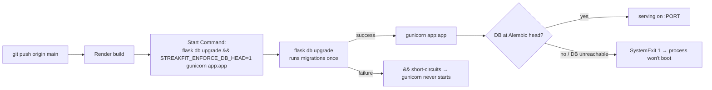

# Deployment, Render Architecture & Startup

How StreakFit gets from a git push to a running production process, and why the startup sequence is shaped to **refuse to serve on a bad schema**. Operational runbooks (rollback, incidents) are in [`../runbooks.md`](../runbooks.md); this doc is the architecture.

## Deployment flow



- **Trigger:** `git push origin main` auto-deploys (~1 min). **There is no staging branch — merging to `main` *is* deploying to production.** Confirm a frontend deploy by watching `static/sw.js` cache-version flip.
- **Migrations run in the deploy step, never on boot.** The `&&` means a failed `flask db upgrade` stops gunicorn from starting — a bad migration fails the deploy instead of half-migrating a live process.
- **Single gunicorn worker**, bare `gunicorn app:app` (no `WEB_CONCURRENCY`, no config file). Consequence: in-process caches and `memory://` rate-limit storage are effectively global today — and become per-worker the moment you scale out (see [../operations/production-readiness.md](../operations/production-readiness.md)).

## ⚠️ Deploy artifacts are NOT in the repo

There is **no `Procfile`, no `render.yaml`, no `wsgi.py`, no gunicorn config file.** The Start Command exists only as a comment in `app.py` and in `CLAUDE.md`. **The source of truth for how production actually starts is the Render dashboard**, which is not version-controlled here. This is a real risk — a new owner cannot reconstruct the deploy from the repo alone. Making the deploy declarative (`render.yaml`) is a recommended immediate item (roadmap).

## Startup sequence (what happens on `import app` → boot)

```mermaid
sequenceDiagram
    participant P as Python import app
    participant Guard as _assert_db_at_head()
    participant DB
    P->>P: Flask(__name__); load config
    Note over P: require SECRET_KEY & JWT_SECRET_KEY<br/>(RuntimeError at import if missing)
    P->>P: db/migrate/jwt/limiter instantiated
    P->>P: _PROCESS_STARTED_AT, _DUMMY_PW_HASH computed
    P->>P: import anthropic (~473 ms — 53% of cold start)
    alt STREAKFIT_ENFORCE_DB_HEAD == '1'
        P->>Guard: run boot guard
        Guard->>DB: read current Alembic revision
        Guard->>Guard: compare to migration-chain head
        alt mismatch OR DB unreachable
            Guard-->>P: log critical + SystemExit(1)
        else match
            Guard-->>P: log "migration check passed"
        end
    end
    P->>P: gunicorn serves app:app
```

### Import-time facts
- **Required env at import:** `SECRET_KEY`, `JWT_SECRET_KEY` — absence is a hard `RuntimeError`. `ANTHROPIC_API_KEY` is soft (coach 503s without it).
- **Measured cold start ≈ 885 ms**, of which **`import anthropic` ≈ 473 ms (53%)**. Since the SDK is only needed when someone actually chats, lazy-importing it is the single biggest startup win (roadmap; deferred because it's coupled to the test monkeypatch pattern).
- `_DUMMY_PW_HASH` (login timing) and `_PROCESS_STARTED_AT` (honest "last deploy" proxy — each deploy is a fresh process) are computed once here.

### The boot guard (`_assert_db_at_head`, gated by `STREAKFIT_ENFORCE_DB_HEAD=1`)
Reads the DB's stamped Alembic revision and compares to the chain head. On mismatch **or** any error (including DB unreachable) it logs `critical` and `SystemExit(1)`. The gate keeps it from firing during `flask db upgrade` itself and during tests/local dev. **Why:** it makes "serving on a schema that doesn't match the code" impossible — the failure mode is a refused boot (loud, safe), not silent data corruption. See [ADR-0010](../adrs/0010-migrations-single-source-of-truth.md).

## Runtime environment

| Env var | Required? | Controls |
|---|---|---|
| `DATABASE_URL` | prod: yes | DB URI (`postgres://` auto-rewritten to `postgresql://`); local falls back to SQLite |
| `SECRET_KEY` | **yes (import)** | Flask secret |
| `JWT_SECRET_KEY` | **yes (import)** | JWT signing |
| `ANTHROPIC_API_KEY` | soft | coach; unset → 503 |
| `RATELIMIT_STORAGE_URI` | no | limiter backend, default `memory://` |
| `ADMIN_SECRET` | recommended | admin gate; unset → all admin routes 403 |
| `RENDER_GIT_COMMIT` | no | commit SHA for admin display |
| `STREAKFIT_ENFORCE_DB_HEAD` | prod: `1` | enables the boot guard |
| `PORT` | no | dev server only |

### Engine / pool config
`SQLALCHEMY_ENGINE_OPTIONS`: `pool_pre_ping=True`, `pool_recycle=280`. No explicit `pool_size`/`max_overflow` (SQLAlchemy defaults). **Why these two:** Neon serverless Postgres auto-suspends and silently drops idle connections; pre-ping validates a connection before use and recycle retires it at 280 s (under Neon's idle window). This is the correct pairing for serverless PG — keep it. Connection-pool sizing becomes a real question at scale (roadmap).

### Dependency pins (`requirements.txt`)
Everything pinned **except `anthropic>=0.40.0`** (floating lower bound) — a build-reproducibility risk, since a new anthropic release could change SDK behavior at deploy time. `alembic` is used at boot but only pulled transitively via Flask-Migrate (unpinned). Python pinned to **3.12.7** (`runtime.txt` / `.python-version`). Pinning `anthropic` and adding `alembic` explicitly are cheap immediate items.

> **Local/test caveat:** the pinned SQLAlchemy 2.0.27 / Python 3.12.7 combo won't import on Python 3.14; the test venv used for this repo runs a newer SQLAlchemy. Match `runtime.txt` locally, or use a 3.12 venv, to reproduce production behavior.
