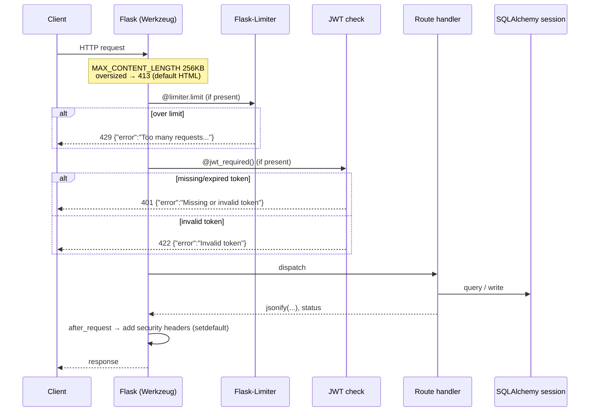
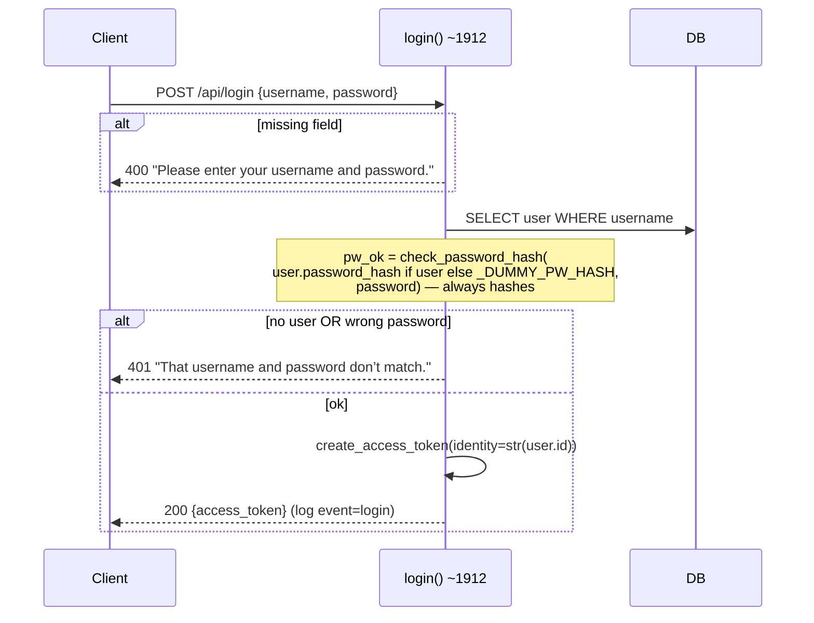

# Request Flows

How requests move through the StreakFit backend, from the generic lifecycle to the three flows worth diagramming because they have real logic (login, mission completion, coach + weather).

## Generic request lifecycle

Every request passes the same rails. There is **no `before_request` hook** — the only global handler is `after_request` (security headers). Auth, rate limiting, and body-size are enforced per-route by decorators/config.



**Error model.** Handlers return `{"error": "<message-or-code>"}` with an appropriate status. Two deliberate exceptions return Flask's default (non-JSON) body: **413** (body over 256 KB) and the **admin 403** from `_require_admin_secret()`. Generic handlers exist for 400/404/429/500; there is no custom 413 or 403 handler. See [../api/README.md](../api/README.md) for the full contract.

**Session lifecycle.** Flask-SQLAlchemy gives each request a scoped session, torn down at request end. Handlers own their commits; the coach persist path is the one place with an explicit atomic transaction (see [coach-subsystem.md](coach-subsystem.md)).

## Flow 1 — Login

The interesting part is **timing equalization**: an unknown username still runs a full password hash against a fixed dummy hash, so response time doesn't leak whether an account exists. See [ADR-0008](../adrs/0008-security-headers-and-login-timing.md).



- Token: HS256 JWT, identity = `str(user.id)`, **1-hour expiry**, sent as `Authorization: Bearer`.
- Cost: ~**81 ms median** locally — pbkdf2 hashing dominates (measured). This is intentional and is the login latency floor.
- Rate limit: **10/min per IP**. (Profiling tripped this immediately — relevant for shared-IP/NAT clients; see [../engineering-roadmap.md](../engineering-roadmap.md).)

## Flow 2 — Complete a daily exercise

The richest write path: idempotent completion, first-time bonuses, the 5-exercise "mission complete" threshold, XP/acorn awards, and team campfire propagation with Rickie team posts.

```mermaid
sequenceDiagram
    participant C as Client
    participant H as complete_daily_exercise() ~2357
    participant DB as DB
    C->>H: POST /api/daily/{exercise_key}/complete (JWT)
    H->>DB: load user; generate today's exercise list
    alt key not in today's list
        H-->>C: 400 "Exercise not in today's daily list"
    end
    H->>DB: INSERT DailyCompletion (unique user/date/key → idempotent)
    opt first ever completion of this key
        H->>DB: award new_exercise (+20 XP / +5 acorns)
    end
    opt reached 5 completions today
        H->>DB: award mission_complete (+25/+3) + perfect_mission (+15/+2)
        loop each team the user is in
            H->>DB: TeamCampfire.total_team_missions += 1
            H->>DB: TeamMoment(campfire_log_added) [+ campfire_stage_reached on crossing]
            opt team's first log / stage crossing
                H->>DB: Rickie TeamMessage
            end
        end
    end
    H->>DB: award_progress → ProgressEvent rows; update User xp/acorns
    H-->>C: 200 {completed_count, team_campfire_updates, xp_awarded, leveled_up, ...}
```

**Why idempotent:** the `uq_daily_completion(user_id, date, exercise_key)` constraint means a double-tap or retry never double-awards. Awards are gated on *transitions* (first-ever, crossing 5, crossing a campfire stage), not on the request firing.

## Flow 3 — Coach turn (with weather tool)

Full detail (memory, notes, cache, transactions) is in [coach-subsystem.md](coach-subsystem.md); this is the request-level shape.

```mermaid
sequenceDiagram
    participant C as Client
    participant H as coach() ~3809
    participant DB as DB
    participant A as Anthropic
    participant W as Open-Meteo (via cache)
    C->>H: POST /api/coach {message, context} (JWT; 10/day + 3/min)
    H->>H: validate (≤500 chars; context.type in general/insight)
    alt no ANTHROPIC_API_KEY
        H-->>C: 503 {"error":"coach_unavailable"}
    end
    H->>DB: load user stats + Coach Notes + last 10 turns
    H->>H: assemble system prompt (frozen bible + context + notes)
    loop up to 3 iterations (initial + 2 tool rounds)
        H->>A: messages.create(sonnet-5, tools=[get_weather])
        alt stop_reason == tool_use (get_weather)
            H->>W: _weather_tool_result(city) [cache → 0/1/2 outbound calls]
            W-->>H: tool_result (is_error on failure — never raises)
        else final text
            Note over H: break
        end
    end
    H->>DB: _persist_coach_interaction (atomic: 2 turns + prune + notes, 1 commit)
    Note over H: persist failure is logged, reply still returned
    H-->>C: 200 {reply}
    alt any exception in the block
        H-->>C: 503 {"error":"coach_unavailable"}
    end
```

**Blast radius is contained.** The whole Anthropic block is wrapped: any failure returns `503 coach_unavailable` and the rest of the app is unaffected. Persistence failure is *swallowed* (logged) so a memory-write hiccup never costs the user their reply — but a DB error inside the atomic persist rolls back cleanly first.
