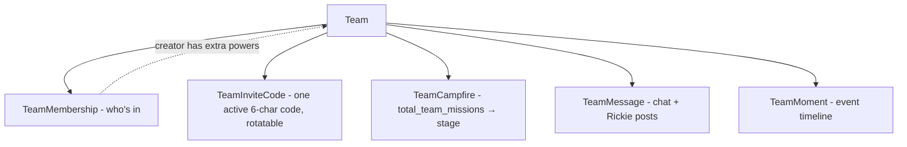

# Team System

Small accountability groups. A team has members, one rotating invite code, a shared **campfire** (a cumulative team-mission counter with named stages), a **chat**, and a **moments** timeline. Rickie posts fixed-template messages on notable team events. Routes ~2636–3095; models in [data-model.md](data-model.md).

## Concepts

- **Membership & caps.** Free plan: **8 members/team**, **10 teams/user**. Plus: **25 members**, unlimited teams. A team's effective member cap is 25 if *any* member is Plus, else 8. Caps enforced at create/join.
- **Invite codes.** One active code per team (`unique(team_id)` + `unique(code)`), 6 chars A–Z/0–9. `rotate-invite` (creator-only) replaces it and stamps `rotated_at`, invalidating the old code.
- **Campfire stages.** Cumulative `total_team_missions` maps to a stage: Kindling (0) → Small Flame (100) → Campfire (300) → Bonfire (750) → Beacon (2000). The counter increments once per team per member's daily "mission complete" (see the daily-complete flow in [request-flows.md](request-flows.md)).
- **Moments** are an append-only timeline: `team_created`, `member_joined`, `member_left`, `campfire_log_added`, `campfire_stage_reached`. Read newest-first.
- **Rickie team posts** are **fixed templates** (not the AI coach): a welcome on a member joining, a post on the team's first campfire log, and on stage crossings. Stored as `TeamMessage` with `sender_type='rickie'` and `sender_user_id = NULL`.

## Authorization model

Every team read/write checks **active membership** (`TeamMembership` for the caller), returning `403 Forbidden` otherwise. A subset of actions is **creator-only** (`created_by_user_id == caller`): remove a member, rotate the invite code. This check is repeated by hand in each handler — a `@team_member_required` / `@team_creator_required` decorator is the obvious future extraction (roadmap).

| Action | Who | Notes |
|---|---|---|
| read team / roster / chat / moments / campfire | any member | 403 for non-members |
| post message | any member | 30/min; ≤240 chars |
| join | anyone with the code | caps enforced; `member_joined` moment + Rickie welcome |
| leave | any member | `member_left` moment |
| remove member | creator only | can't remove self (use leave); silent (no moment) |
| rotate invite | creator only | — |

## Endpoints (summary)

Full request/response in [../api/openapi.yaml](../api/openapi.yaml).

| Method & path | Purpose |
|---|---|
| `POST /api/teams` | create (10/min) |
| `GET /api/teams` | caller's teams + stage summary |
| `GET /api/teams/lookup/{code}` | preview a team by invite code |
| `GET /api/teams/{id}` | full team + roster |
| `POST /api/teams/{id}/join` | join by code (10/min) |
| `POST /api/teams/{id}/leave` | leave |
| `DELETE /api/teams/{id}/members/{uid}` | creator removes a member |
| `POST /api/teams/{id}/rotate-invite` | creator rotates code |
| `GET /api/teams/{id}/campfire` | counter + stage |
| `GET /api/teams/{id}/moments` | timeline (desc) |
| `GET /api/teams/{id}/messages` | chat (asc) |
| `POST /api/teams/{id}/messages` | post (30/min) |

## Query shape & the N+1 history

Team reads that list people (`get_team` roster, `get_team_moments`, `get_team_messages`) need usernames for a set of user ids. There are **no ORM relationships** to eager-load, so these use a single batch lookup `_usernames_for_ids(ids)` → `{id: username}` and map over the rows — one query for all names instead of one per row. This was the WS3 N+1 fix; `tests/test_query_counts.py` guards it (asserts flat, not 1+N). Measured: a 30-member team read is ~7 queries total, a 50-message read ~2. See the roadmap for the remaining N+1 candidates (`admin_stats`, `list_teams`, `get_memory_book`) that weren't in scope.

> **Behavior note:** `get_team` skips an orphaned membership (a member row whose user is gone) with `continue` rather than 500-ing, and `member_count` reflects the skip. With the deletion policy above this shouldn't occur, but the handler is defensive.

## Shared-data implications

Team messages and moments are **shared** content. When a user is deleted, their authored messages and subject-moments are **anonymized (SET NULL)**, not removed — the team's history stays coherent for everyone else. This is why `sender_user_id`/`subject_user_id` are nullable and why deletion is application-controlled ([data-model.md](data-model.md), [ADR-0006](../adrs/0006-application-level-account-deletion.md)).
