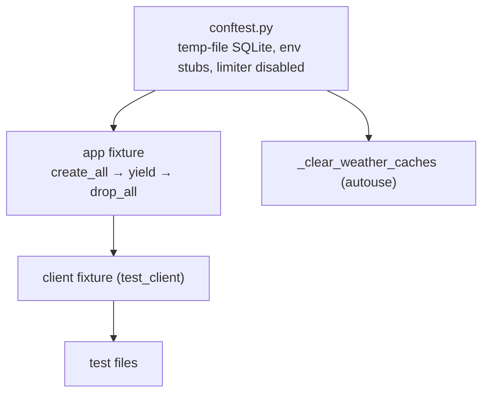
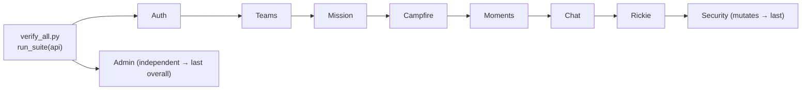

# Verification & Test Architecture

StreakFit has **two distinct test layers** that serve different purposes and must not be confused:

1. **pytest** (`tests/`) — fast unit/integration tests against a throwaday DB. Verifies backend *logic*.
2. **The Verification Suite** (`scripts/verify_all.py` + `scripts/verification/`) — end-to-end checks that drive the *deployed app* the way a real client would. Verifies the app is *reachable and correct through its real surface*, and is **safe to run against production**.

This split is the "StreakFit Verification Standard" in `CLAUDE.md`: a feature isn't done until it has code + manual UI check + an automated `scripts/verification/` check + suite inclusion. The reason is scar tissue — the R2 team layer shipped features that worked but were unreachable through the UI; only end-to-end verification catches that class of bug.

## Layer 1 — pytest (`tests/`)

**155 test functions across 16 files.** Builds its DB with `create_all()` (bypasses Alembic) — *except* `test_migrations.py`, which is the deliberate exception.



### Fixtures (`conftest.py`)
| Fixture | Scope | Autouse | Sets up |
|---|---|---|---|
| `app` | function | no | `TESTING=True`, app_context, `create_all` → yield → `session.remove()` + `drop_all` |
| `client` | function | no | `app.test_client()` |
| `_clear_weather_caches` | function | **yes** | clears `_GEOCODE_CACHE` / `_FORECAST_CACHE` so a cached city can't leak between tests |

Module-level setup stubs `SECRET_KEY`/`JWT_SECRET_KEY`, points `DATABASE_URL` at a **temp-file** SQLite DB (not in-memory — the test client and app share a pool and in-memory hits threading edge cases), and **disables the limiter** (`limiter.enabled = False`, because Flask-Limiter reads its enabled flag at init). Auth helpers: `register_and_login(client, username)` → token; `auth_headers(token)`.

### Coverage map
| Area | Files (tests) |
|---|---|
| Auth | `test_auth.py` (5), `test_api_contract.py` (13) |
| Coach | `test_coach.py` (18), `test_coach_memory.py` (27) |
| Teams | `test_teams.py` (17), `test_team_chat.py` (9), `test_team_moments.py` (9), `test_remove_member.py` (9), `test_rickie_team_reactions.py` (6), `test_campfire.py` (6) |
| Deletion / cleanup | `test_account_deletion.py` (10), `test_cleanup_qa_smoke.py` (5) |
| Security | `test_security.py` (7) |
| Weather | `test_weather_cache.py` (11) |
| Query counts | `test_query_counts.py` (2) |
| Migrations | `test_migrations.py` (1) |

**`test_migrations.py` is special:** it runs `flask db upgrade` via subprocess against an empty DB and asserts the migrated schema matches the models (tables/columns/PKs/FKs/uniques/indexes; server-defaults excluded). This is the guardrail from [ADR-0010](../adrs/0010-migrations-single-source-of-truth.md). **No schema change is done until this passes.**

Gaps and duplication are analyzed in the [testing roadmap](../engineering-roadmap.md#phase-4--testing-roadmap) — briefly: `auth`/`mission`/`brainboost` have thin pytest coverage; team behavior is spread across six files with overlapping setup that a shared fixture could consolidate.

## Layer 2 — The Verification Suite (`scripts/verification/`)

End-to-end checks that share one scenario across modules, run **in dependency order**, and only ever create disposable `qa_smoke_*` accounts and `Smoke Test <tag>` teams — never touching real data. Safe against production at any time.



- **Two transports, same checks:** `ApiClient` (real HTTP, for CLI/CI) and `WsgiClient` (in-process `test_client`, used by the in-app "Run Verification" button — a single-worker server can't HTTP itself). Both satisfy `api.request(method, path, token, body)`.
- **Module order matters:** `Security` mutates/removes membership so it runs after the other team modules; `Admin` is independent and runs last.
- **Exit codes:** `0` all passed, `1` ≥1 check failed, `2` a setup step aborted the run.
- **Suite version** is `VERIFICATION_SUITE_VERSION = 2` (bumped by hand), recorded in each `VerificationRun` row so StreakFit Control can show run history.
- **Not yet covered:** `brainboost`, 1:1 `coach`, `notifications`, `pwa` (module stubs listed in the suite README).

### The `qa_smoke_*` convention
Accounts: `qa_smoke_<role>_<run_tag>`, password `SmokeTest123!`; teams `Smoke Test <run_tag>`; `run_tag = <epoch>_<6 alnum>`. Cleanup is `scripts/cleanup_qa_smoke.py` — **exact Python prefix** `qa_smoke_` (never SQL `LIKE`, because `_` is a wildcard), two groups (SAFE = no team owned, deletable; BLOCKED = team owners, manual), dry-run by default, `--execute` deletes only SAFE via `delete_user_account`, `SANITY_CAP=1000` hard-abort. See [ADR-0007](../adrs/0007-qa-cleanup-safe-vs-blocked.md).

## How to run

```bash
# pytest (fast, local)
pytest tests/                          # 155 tests

# migration integrity (part of the standard)
pytest tests/test_migrations.py

# end-to-end suite against a target (safe on prod)
python scripts/verify_all.py                 # defaults to production
python scripts/verify_all.py --base-url http://localhost:5000

# clean up smoke accounts (needs prod DATABASE_URL in env)
python scripts/cleanup_qa_smoke.py           # dry-run: shows SAFE vs BLOCKED
python scripts/cleanup_qa_smoke.py --execute # deletes SAFE only
```
