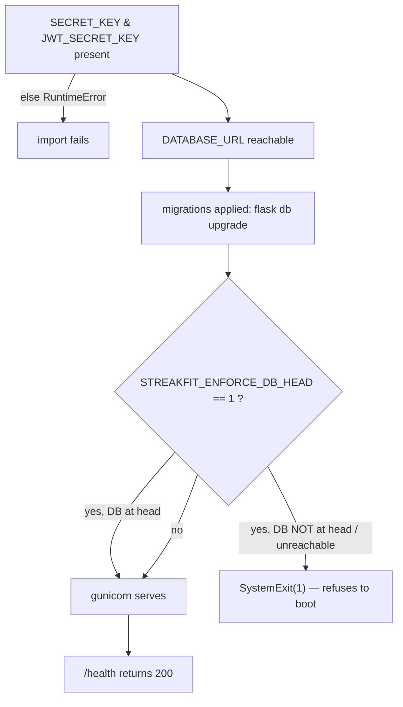

# Environment, Secrets & Startup Prerequisites

The complete, authoritative reference for everything the StreakFit process needs to run — every environment variable, which are secrets, what fails without them, the startup dependency chain, and the migration contract. If it's operationally required to run StreakFit, it's here. Template: [`../../.env.example`](../../.env.example). Architecture context: [../architecture/deployment.md](../architecture/deployment.md).

## Environment variables

| Variable | Required? | Secret? | Default | What it controls / what breaks without it |
|---|---|---|---|---|
| `SECRET_KEY` | **Yes** | 🔒 | — | Flask session/signing key. **`RuntimeError` at import if unset** — the process will not start. |
| `JWT_SECRET_KEY` | **Yes** | 🔒 | — | HS256 signing key for access tokens. **`RuntimeError` at import if unset.** |
| `DATABASE_URL` | Prod: **Yes** | 🔒 | `sqlite:///streakfit.db` | SQLAlchemy connection string. `postgres://` is auto-rewritten to `postgresql://`. Local dev falls back to SQLite when unset. |
| `ANTHROPIC_API_KEY` | No (soft) | 🔒 | — | Powers Rickie. **Unset → `/api/coach` returns `503`; the rest of the app is unaffected** (fail-closed). |
| `ADMIN_SECRET` | Prod: recommended | 🔒 | `''` | Shared secret for `/api/admin/*` (header `X-Admin-Secret`). **Unset/empty → all admin routes `403`** (fail-closed). |
| `STREAKFIT_ENFORCE_DB_HEAD` | Prod: **`1`** | — | unset | Enables the boot guard. `== '1'` → process `SystemExit(1)` unless the DB is at the Alembic head. Must be set **inline on gunicorn only**, never globally (see below). |
| `STREAKFIT_EVIDENCE_KEY` | Prod: **Yes** (for photo evidence) | 🔒 | — | urlsafe-base64 32-byte Fernet key sealing reported images. **Unset → nothing is captured** and the reviewer is told `no_evidence_key` (fail-closed, deliberately). Must be IDENTICAL on the web service and any pruning cron — a different key there leaves photos undecryptable but still purgeable. **No rotation path exists**: a new key makes every previously sealed image permanently unreadable. Never generated by the app. |
| `STREAKFIT_RETENTION_SWEEPER` | Prod: **`1`** | — | unset | Starts the in-process hourly thread that sweeps coach turns **and** moderation evidence. Unset → neither is swept unless a cron runs. Inline on gunicorn only, like the DB-head guard. |
| `STREAKFIT_RETENTION_INTERVAL_S` | No | — | `3600` | Sweeper thread interval. Lowered in local testing to watch a sweep happen; leave at the default in production. |
| `STREAKFIT_NOTIFY_CHANNEL` | No | — | unset | Which delivery channel moderation notices use. **Unset → nothing is delivered and nothing is claimed as delivered** — the honest default until a provider is chosen. `console` prints but deliberately certifies nothing. |
| `STREAKFIT_PUBLIC_URL` | No | — | `''` | Base URL used to build the queue link inside a notification. Unset → the message says "the moderation queue" in words rather than guessing a host. |
| `STREAKFIT_CHILD_AI_ASSURANCE_ON_FILE` | No | — | unset | `1` asserts that written 16 CFR 312.8(c) assurances from the AI provider exist. Until set, **no consent can unlock Ask Rickie for a known under-13**. Setting it is a legal claim, not a feature flag. |
| `RATELIMIT_STORAGE_URI` | No | — | `memory://` | Flask-Limiter backend. Default is per-worker in-memory (resets every deploy). Point at `redis://…` for shared limits. |
| `RENDER_GIT_COMMIT` | No | — | `git rev-parse HEAD` | Commit SHA shown in the admin dashboard. Render sets it automatically. |
| `PORT` | No | — | dev `5000` | Dev server (`python app.py`) uses it. **In prod Render sets `PORT` (default 10000) and gunicorn honors it** — its default `bind` becomes `0.0.0.0:$PORT`, which is why the start command needs no `--bind`. |

🔒 = secret: never commit, never log, set via the Render dashboard (prod) or `.env` (local, git-ignored).

### Secrets inventory (what an operator must provision in prod)
1. `SECRET_KEY` — random 32-byte hex.
2. `JWT_SECRET_KEY` — random 32-byte hex, **different** from `SECRET_KEY`.
3. `DATABASE_URL` — the managed Postgres connection string.
4. `ANTHROPIC_API_KEY` — from the Anthropic console (billed).
5. `ADMIN_SECRET` — random; whoever holds it can reach `/api/admin/*`.

Generate a secret: `python -c "import secrets; print(secrets.token_hex(32))"`.

> **The `STREAKFIT_ENFORCE_DB_HEAD` trap.** It must be set **inline on the gunicorn command** (`… STREAKFIT_ENFORCE_DB_HEAD=1 gunicorn app:app`), **not** as a global/dashboard env var. If it were global, the boot guard would also fire during `flask db upgrade` (which imports the app) *before* the upgrade runs — and a behind-head DB would `SystemExit(1)`, so the migration could never apply. Deadlock. Keep it inline.

## Startup dependency chain

What must be true, in order, for the process to serve traffic:

1. **Import-time:** `SECRET_KEY` and `JWT_SECRET_KEY` must exist or the module raises `RuntimeError` before anything runs. `ANTHROPIC_API_KEY` is read but optional.
2. **Database:** `DATABASE_URL` must point at a reachable DB. Engine options `pool_pre_ping=True`, `pool_recycle=280` handle Neon serverless connection drops.
3. **Migrations:** the schema is built **only** by `flask db upgrade` (no `create_all()` on boot). This runs as a deploy step, before gunicorn.
4. **Boot guard:** with `STREAKFIT_ENFORCE_DB_HEAD=1`, the serving process verifies the DB is stamped at the Alembic head (`q1r2s3t4u5v6`) and exits otherwise.
5. **Ready:** `GET /health` → `200 {"status":"ok"}` (runs a `SELECT 1`).

## Migration contract (what an operator must know)

- **Migrations are the single source of truth for the schema.** A fresh DB is built entirely by `flask db upgrade`; there is no manual bootstrap. Enforced by `tests/test_migrations.py`. See [ADR-0010](../adrs/0010-migrations-single-source-of-truth.md).
- **Migrations run in the deploy step, never on boot.** Start command: `flask db upgrade && STREAKFIT_ENFORCE_DB_HEAD=1 gunicorn app:app` — a migration failure short-circuits the `&&` and gunicorn never starts.
- **The serving process refuses to boot on a schema mismatch** (boot guard). A code deploy whose migrations didn't run leaves the process dead, not silently wrong.
- **Current head:** `q1r2s3t4u5v6`. Check a live DB with `flask db current`; list history with `flask db history`.
- **Rolling back a deploy that ran a forward migration** requires `flask db downgrade` to the matching revision, or the boot guard blocks the reverted code. See [../runbooks.md](../runbooks.md) → Rollback.

## Operational prerequisites (external to the repo)

| Prerequisite | Why | Where |
|---|---|---|
| Managed PostgreSQL (Neon) | Primary datastore | `DATABASE_URL` |
| Anthropic account + key | Rickie coach (billed per call) | `ANTHROPIC_API_KEY` |
| Render web service (git-linked to `main`) | Hosting + auto-deploy | Render dashboard |
| Python **3.12.7** | Pinned runtime; SQLAlchemy 2.0.27 doesn't import on 3.14 | `runtime.txt`, `.python-version` |
| DB backup/PITR | Recovery | Render/Neon dashboard — **confirm cadence + test a restore** |

Open-Meteo (weather) needs **no** account/key — it's called anonymously; the only operational note is the shared-egress-IP 429 risk documented in [../architecture/coach-subsystem.md](../architecture/coach-subsystem.md) and [ADR-0005](../adrs/0005-in-process-weather-cache.md).
