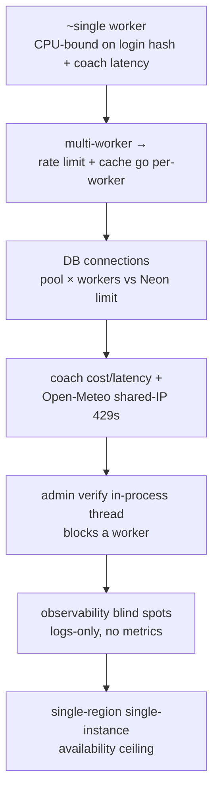

# Production Readiness — Scaling from 100 to 100,000 Users

An engineering roadmap, **not** an implementation. It answers one question: *as StreakFit grows 1000×, what breaks first, and in what order should we invest?* Grounded in the current architecture ([../architecture/](../architecture/)) and the measured profile ([../engineering-roadmap.md](../engineering-roadmap.md#phase-5--performance-measured)).

**Legend** — Effort S/M/L, Risk, Priority P0/P1/P2 as in the engineering roadmap. "Breaks at" is a rough order-of-magnitude, not a promise.

## The one sentence that matters

**Three correctness properties hold today only because there is a single gunicorn worker:** rate limiting (`memory://`), the weather cache (in-process), and — less visibly — the fact that in-process state is effectively global. **The moment you add a second worker or a second instance, all three change behavior.** So the *first* scaling step (more workers) is also the one that forces the *first* infrastructure investments (shared rate-limit store, shared/keyed cache). Plan them together.

## What breaks first — ordered

1. **Concurrency ceiling (breaks ~low hundreds of concurrent requests).** One worker serializes. Login is ~81 ms of CPU (pbkdf2) and each coach turn holds a worker for the full Anthropic round-trip (seconds). A handful of concurrent coach chats saturates the single worker.
2. **Per-worker state (breaks the moment you add workers).** `memory://` rate limits and the weather cache are per-process — N workers = N× the effective limits and N× provider calls.
3. **DB connections (breaks when workers × pool > Neon limit).** No `pool_size` set (SQLAlchemy default 5 + overflow). Multiple workers × instances can exhaust Neon's connection cap.
4. **Coach cost & upstream limits (breaks on spend, not errors).** Every coach turn is a paid Sonnet-5 call; Open-Meteo 429s recur if per-worker caches multiply outbound calls on a shared egress IP.
5. **Admin verification (breaks operator UX under load).** `POST /api/admin/verify` spawns a daemon thread that runs the whole suite in-process — it competes with request handling and doesn't survive a restart.
6. **Observability (already a gap).** There are good structured INFO logs but **no metrics, no traces, no dashboards, no alerting** — at 100k users you're debugging blind.
7. **Availability (architectural ceiling).** Single Render service, single region, deploy = brief unavailability, no blue-green.

## Roadmap by area

### Database
| Item | Benefit | Effort | Risk | Priority |
|---|---|---|---|---|
| Set explicit `pool_size`/`max_overflow`/`pool_timeout` sized to `workers × instances` vs Neon's limit | Prevents connection exhaustion under concurrency | S | Low | **P0 before multi-worker** |
| Add `ON DELETE` constraints (the deferred `db_integrity_matrix.md` migration) | DB-level integrity as a second code path appears | M | Medium (prod migration) | P1 |
| Make `progress_event.team_id` a real FK (backfill/validate first) | Removes a dangling-reference class | M | Medium | P1 |
| Read replica for read-heavy endpoints (daily, memory-book, team reads) | Offloads the primary as reads dominate | L | Medium | P2 |
| Reconcile denormalized `user.xp_total`/`acorns_total` vs `progress_event` (audit + guard) | Single source of truth for progress | M | Medium | P2 |

### Rate limiting
| Item | Benefit | Effort | Risk | Priority |
|---|---|---|---|---|
| Move `RATELIMIT_STORAGE_URI` to **Redis/Valkey** | Limits become correct & shared across workers/instances; survives deploys | M | Medium (new dependency) | **P0 with multi-worker** |
| Add per-user (not just per-IP) limits on coach/expensive routes | Contains cost abuse; avoids NAT false-positives | S | Low | P1 |
| Custom JSON 429 already exists — keep; add `Retry-After` | Better client backoff | S | Low | P2 |

### Caching
| Item | Benefit | Effort | Risk | Priority |
|---|---|---|---|---|
| **Keyed Open-Meteo provider** (per-account quota) — the already-documented escalation | Removes shared-IP 429 exposure independent of worker count | S | Low | **P0-P1 when 429s recur** |
| Shared weather cache (Redis) if staying keyless | One cache across workers; fewer provider calls | M | Medium | P1 |
| Cache hot read responses (daily config, insight library) | Cuts repeat compute/serialization | M | Low | P2 |

### Background jobs
| Item | Benefit | Effort | Risk | Priority |
|---|---|---|---|---|
| Move admin verification off the request process (worker queue / one-off job) | Stops it competing with serving; survives restart | M | Medium | P1 |
| A real job runner (RQ/Celery/Render cron) for future async work (emails, digests, cleanup) | Foundation for anything async; `cleanup_qa_smoke` and future notifications belong here | M | Medium | P1 |
| Scheduled `qa_smoke_*` cleanup + orphan sweep | Keeps prod tidy without manual runs | S | Low | P2 |

### Monitoring & observability
| Item | Benefit | Effort | Risk | Priority |
|---|---|---|---|---|
| **Metrics** (request rate/latency/error by route; coach success/latency; cache hit-rate; DB pool usage) | You can see saturation before users do | M | Low | **P0-P1** |
| **Alerting** on `/health`, 5xx rate, coach 503 rate, DB errors | Know before the user tells you | S-M | Low | P1 |
| Distributed tracing on the coach path (app → Anthropic → Open-Meteo) | Attributes latency to the right upstream | M | Low | P2 |
| Turn the existing `event=...` logs into structured/queryable events | The log vocabulary is already good; make it aggregatable | S | Low | P1 |

### Logging
| Item | Benefit | Effort | Risk | Priority |
|---|---|---|---|---|
| Emit a metric/counter alongside `coach memory persist failed` and DB-integrity warnings | These are currently invisible unless grepped | S | Low | P1 |
| Add request-id correlation to logs | Trace one request across log lines | S | Low | P2 |
| Ship logs to a queryable sink (beyond Render's tail) | Retention + search at scale | S | Low | P1 |

### Deployment
| Item | Benefit | Effort | Risk | Priority |
|---|---|---|---|---|
| **Declarative deploy (`render.yaml`)** + committed Start Command | Deploy is reviewable and rebuildable from git (today it isn't) | S | Low | **P0** |
| A **staging** service (branch or separate Render service) | Test migrations/deploys before prod; today merge-to-main = deploy-to-prod | M | Low | P1 |
| Multi-worker / multi-instance (after P0 rate-limit + cache + pool items) | Horizontal scale | M | Medium (depends on the shared-state items) | P1 |
| Blue-green / zero-downtime deploy | No deploy-time blips | M | Medium | P2 |

### Backups & recovery
| Item | Benefit | Effort | Risk | Priority |
|---|---|---|---|---|
| Confirm + document Neon/Render PITR cadence and a **tested restore** drill | A backup you haven't restored isn't a backup | S | Low | **P0** |
| Automate a pre-deploy logical backup for risky migrations | Cheap insurance on schema changes | S | Low | P1 |
| Document RPO/RTO targets | Sets expectations before an incident | S | Low | P2 |

## Suggested sequencing (dependency-aware)

1. **P0 pre-scale foundation (cheap, unblocks everything):** declarative deploy (`render.yaml`), pin `anthropic`, set DB pool size, confirm+test backups, stand up metrics/alerting. None of these change behavior; all reduce risk.
2. **P0/P1 "before the second worker":** Redis rate-limit storage **and** the weather-cache decision (keyed provider or shared cache), together — because adding a worker without them silently breaks limits and multiplies provider calls.
3. **P1 scale-out:** multi-worker/instance, move admin verify off the request process, staging service, N+1 cleanup (`get_memory_book`), DB integrity constraints.
4. **P2 maturity:** read replica, tracing, blue-green, stats reconciliation, frontend build step.

> **Guiding principle:** every P0 here is a *risk reducer that doesn't change behavior* — do them regardless of growth. The behavior-changing scale work (P1/P2) should be **triggered by measured signals** from the metrics you stand up in step 1, not by a calendar.
